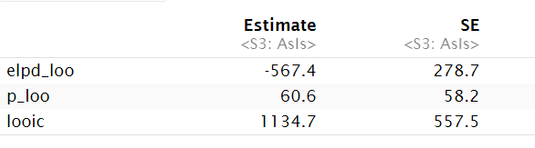
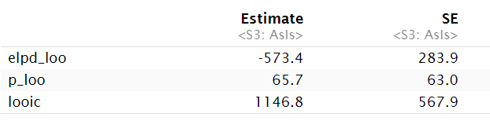
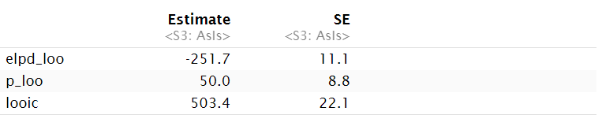
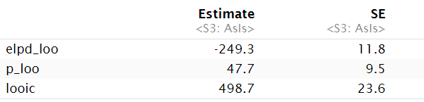

```{r setup, include=FALSE}
knitr::opts_chunk$set(echo = TRUE)
```

## Working link to a public repo:
https://github.com/eunicekim919/STAT-447c-project.git

## Contributions of each team member:

## Introduction (Problem formulation)
In recent years, densely populated regions worldwide have experienced fluctuating crime rates due to various economic and environmental factors such as income, job availability, and climate. Historically, Vancouver has consistently had higher than expected about its population size and the average Canadian crime rate, including higher rates of violent crime. (Andresen, 2017; Statistics Canada, 2023) These rising crime rates prompt concerns about public safety, and how to appropriately allocate resources to adequately deal with issues unique to each area. Effective spatial analysis of crime data is crucial for understanding these patterns, predicting future occurrences, and implementing the right preventative measures. When reports are only available for certain regions, being able to interpolate available data spatially could provide important information without needing to expend unnecessary resources. Among the various statistical techniques, kriging offers a robust method of spatial interpolation using Bayesian optimization over a Gaussian process.

This study aims to analyze and compare different kriging models for interpolating crime density in Vancouver using reported crime data from the Vancouver Police Department GeoDASH Open Data, a source that provides aggregate crime data from the crime reports made in the City of Vancouver in 2022. (Vancouver Police Department, 2024). Both Stan and R are used to implement and assess the model, with the performance evaluated through Leave-One-Out Cross-Validation (LOO-CV). This technique assesses the model's predictive performance by leaving one observation out at a time and predicting its value using the rest of the data. Determining the most appropriate kriging model for this type of data & analysis has the potential to contribute to the greater field of geospatial crime analysis as a whole, informing policy decisions and strategic planning for crime reporting and urban safety management. Exploring a variety of kriging approaches, this paper also provides a better understanding of the advantages and disadvantages of the various kriging models. 
Kriging & Bayesian Foundations

  Kriging is the overarching term for a group of geostatistical techniques used for spatial interpolation, which estimate the values at unknown points based on the values of known points based on the values of the known points nearby - based on applications of Tobler’s first law. The foundation of kriging lies in its ability to model spatial autocorrelation through a semivariogram, a function that quantifies the strength of statistical correlation as a function of distance. This works by assuming that the distance between sample points reflects a quantifiable spatial correlation, that can then be used to interpolate values at unsampled locations. Kriging functions as a kind of Bayesian linear estimator, it works by incorporating some prior knowledge about the spatial processes, and then updating with the observed data to make predictions - the unknown values considered as random variables.

### Mathematical Explanation of Kriging
  Kriging leverages the spatial covariance among data points to make predictions at unsampled locations.
The key to kriging is the assumption that the spatial process underlying the observed data is a realization of a Gaussian process, consistent among all types of kriging methods. This process is governed by a mean function (often taken as constant or linear) and a covariance function, which quantifies how observations at different locations relate to one another based on their spatial separation.
	Below is a general mathematical overview of our current understanding of the method’s components. (Handcock & Stein, 1993; Webster & Oliver, 2007; Wiskotten et al., 2023)
	
The observed data $\mathbf{Z}$ are modeled as a realization of a Gaussian process:
$$Z(\mathbf{s}) = \mu(\mathbf{s}) + \epsilon(\mathbf{s})$$
where:
- $\mathbf{s}$ denotes a spatial location.
- $\mu(\mathbf{s})$ is the mean function, often assumed to be constant $\alpha$ across the space.
- $\epsilon(\mathbf{s})$ represents the spatially correlated random error, assumed to follow a multivariate normal distribution.
The core of a kriging model lies in its specification of the spatial covariance. A common choice is the exponential covariance function:
$$cov(Z(\mathbf{s}_i), Z(\mathbf{s}_j)) = \sigma^2 \exp\left(-\frac{\|\mathbf{s}_i - \mathbf{s}_j\|}{\rho}\right)$$
where:
- $\mathbf{s}_i - \mathbf{s}_j$ is the Euclidean distance between locations $\mathbf{s}_i$ and $\mathbf{s}_j$.
- $\sigma^2$ is the process variance.
- $\rho$ is the range parameter, influencing how quickly correlations decay with distance.

The prediction of $Z(\mathbf{s}_0)$ at a new location $\mathbf{s}_0$ using observed data $\mathbf{Z}$ at known locations $\mathbf{s}_1, \ldots, \mathbf{s}_N$ is given by:
$$\hat{Z}(\mathbf{s}_0) = \mu + \mathbf{k}^T \mathbf{K}^{-1} (\mathbf{Z} - \mu \mathbf{1})$$
where:
- $\mu$ is the assumed mean of the process.
- $\mathbf{Z}$ is the vector of observed values at the known locations.
- $\mathbf{k}$ is the vector of covariances between the new location \(\mathbf{s}_0\) and each of the known locations.
- $\mathbf{K}$ is the covariance matrix among the observed data points.
- $\mathbf{1}$ is a vector of ones (assuming a constant mean).

The components of $\mathbf{k}$ and $\mathbf{K}$ are computed using some covariance function:
$$\mathbf{k}[i] = \sigma^2 \exp\left(-\frac{\|\mathbf{s}_0 - \mathbf{s}_i\|}{\rho}\right)$$

$$\mathbf{K}[i,j] = \sigma^2 \exp\left(-\frac{\|\mathbf{s}_i - \mathbf{s}_j\|}{\rho}\right) + \sigma_{\text{err}}^2 \delta_{ij}$$
with $\delta_{ij}$ being the Kronecker delta, which is 1 if \(i = j\) and 0 otherwise, equivalent to the identity matrix in practice.

Finally, the model can also incorporate measurement error $\sigma_{\text{err}}^2$, which adds to the diagonal elements of the covariance matrix $\mathbf{K}$, representing error variance that is independent at each observed location.
Other Spatial Interpolation Methods
	Kriging is one of the most sophisticated geostatistical models, but others serve similar tasks - such as inverse distance weighting which computes the weighted average of nearby observed values or splines, which fit some smooth mathematical function that passes through the data points. However, kriging is often better for more complex given its semivariogram and allowing measures of uncertainty for those estimates. 
	
### Types of Kriging

Since Kriging is highly adaptive, various kinds can be used in different situations. Simple Kriging assumes a known constant mean throughout the entire region. Ordinary Kriging is the most common, it does not assume a known mean and instead estimates it based on available data. Universal kriging pushes the mean estimation further by modelling the mean as a polynomial function of coordinates, best for analyzing trends across a region.  (Mooney et al., 2018). Bayesian Kriging models incorporate spatial modeling utilizing a parametric function of distance that includes the longitude and latitude as random variables. (Zhang & Du, 2019)
Kriging Model Comparisons

While there are many types of kriging, determining which type of kriging is most appropriate for given situations is a complex task. 
Wiskotten et al. discuss the use of ordinary kriging and Bayesian kriging in the context of radiological characterization for nuclear facility decommissioning products, specifically the estimation of quantity of various radionuclides, then using the spatial interpolation to predict contamination levels of unobserved locations. In their case, the Bayesian kriging model showed the most promising results, credited to the fact that it takes into account the parameter’s uncertainty, however is criticized for being computationally expensive.
While Wiskotten et al.'s study focuses on radiological characterization in decommissioning projects, our research centers on predicting crime occurrences in Vancouver using spatial modeling techniques. Our aim is to assess the robustness of the Bayesian kriging approach compared to the universal kriging approach. We will evaluate our models based on the estimates expected log predictive density, the LOO information criterion and root mean squared error (RMSE) of one such test set.

## INITIAL EXPLORATION

### Pre-processing

Upon first analysis of the raw data imported from the Vancouver Police Department, the size and shape of the data made it difficult to work with. Many attempts were made to clean and work with the data as is, but to present an informative and meaningful analysis, we decided instead to alter the data so rather than being a set of points where each point represents one single crime reported, it is a map of equally spaced grid cells that contains a count of how many crimes occured. This was done using ArcGIS Pro, by creating a “fishnet” the size of vancouver with 500m x 500m grid cells and summarizing the number of crimes, then adding in the centre longitude (x-coord) and latitude (y-coord) for each grid, then exporting it as a CSV file. 

### Data Exploration

To better understand the data, some analysis was done to better understand the relationships & to inform choices made in our model. A summary of the number of crimes per month showed approximately equal numbers each 12 months, consistent with past research of crime distribution in areas with temperate conditions, and suggesting that a simpler model that doesn’t account for spatiotemporal relationships could still yield promising results. (Linning, 2015)
	
To quantify the spatial autocorrelation within the dataset, the Global Moran’s Index was calculated. A positive Moran’s Index suggests that nearby or neighbouring locations have similar values (indicating positive spatial autocorrelation), while a negative value suggests that nearby locations have dissimilar values (negative spatial autocorrelation). A value close to zero indicates a random spatial pattern. This data set had a Moran’s Index of 0.644, which on a scale from -1 to +1 suggests a positive spatial autocorrelation. This implies that we should be able to use the distance between the points to spatially interpolate missing data. 

## METHODOLOGY & DATA ANALYSIS

This study employed two kriging models with variations in their structure to attempt to find the best ways to spatially interpolate crime densities from the data set formed. They differ primarily in their handling of the spatial structure and the statistical assumptions about the underlying processes. To compare these two models, our original crime dataset is split 80/20 into training and testing sets, and a prediction is conducted for the counts of the testing set, which is repeated using leave-one-out cross-validation to compare for various splits.  We will evaluate our models based on the estimates of expected log predictive density, the LOO information criterion and a sample root mean squared error (RMSE) on one of the tests.
	

### Model Specifications

The data entered into the model includes `N`, the number of training points, `x`, `y`, the respective longitude and latitude of the training points, `crimes`, the count of crimes of each of the training points, `N_new`, the number of testing points, and `x_new`, `y_new`, the respective longitude and latitude of the training points. 
Model 1 leverages an ordinary kriging framework, characterized by the four parameters:
`alpha` represents the baseline crime density, which is assumed to be constant across the spatial field, with the prior $\alpha \sim Normal(0,10)$
`rho` defines the range parameter or length scale, which influences how quickly the correlation would decay with distance, with the prior  $\rho \sim InvGamma(2,1)$
`sigma` is the spatial variance, controlling the expected variability related to its spatial factors with the prior $\sigma \sim Normal(0,1)$
`sigma_err` accounts for the random noise that may occur in the dataset, with the prior $\sigma_{err} \sim Normal(0,1)$
The spatial structure is modelled using a Gaussian process with the covariance between any two points `i` and `j` are given by  $dist_{ij} =  \sqrt{(x_i - x_j)^2 + (y_i - y_j)^2}$, the Euclidean distance matrix computed from longitude and latitude data. The crimes are then assumed to follow a multivariate normal distribution $crimes \sim Multi-Normal(\mu, \sum)$, where $\sum = \sigma exp(\frac{-dist}{\rho}) + \sigma_{err}I$ and $\mu[i] = \alpha$, since we assume constant mean.

Model 2 simplifies the spatial structure by directly estimating a zero-mean multivariate normal distribution of the crime counts - it similarly uses a covariance matrix for the Gaussian function of distance, but utilizes a Chloseky decomposition for computational efficiency. 

### Prior Justification

In both models, the parameters are given the same priors for their equivalent variables to compare the nature of the models rather than the parameters themselves. An inverse gamma prior for `rho` was selected since we expect a level of spatial continuity, and the longer tail was to accommodate the possibility of significant spatial dependence, as the Global Moran’s Index on this data showed high autocorrelation. The normal priors for `sigma` and `sigma_err` assume most variability near the mean, reflecting the uncertainty we had about our assumption. The broad normal prior `alpha` in Model 1 was to accommodate different baseline densities. While there is a distinct lack of use of kriging in other research related to the spatial interpolation of similar crime data, these priors (notably using normal priors for both sigma & sigma noise) are common choices in other fields when conducting kriging, and provided better results when tested. (Wiskotten et al., 2023; Brown & Brubaker, 2012; Watson, 2018)

## Results

The results from the 'loo' function provide estimates for the expected log predictive density(ELPD), the effective number of parameters and the Leave-One-Out(LOO) information criterion. These metrics offer insights into each of two different model's predictive accuracy and complexity. We used these metrics to compare to Model 1 and Model 2, examining which method would yield better predictive performance. 

We built two different Kriging models with Stan for both Model 1 and Model 2 to compare results: one using the original data (standard model) and another using the logarithmic transformation (log model). To determine which model have better predictive performance, we employed the 'loo_compare' function to evaluate the fit of the models.The decision between the standard model and the log model allows us to find the suitable model to compare two Kriging models. 




The above figures shows that the results for Standard Model 2 and Log Model 2. The Expected Log Predictive Density (ELPD) is a measure of the model's predictive performance, as it serves as a theoretically motivated metric for evaluating predictive ability (Oelrich & Villani, 2024). A higher ELPD suggest better predictive accuracy. Our standard Model 2 had an ELPD estimate of -3039.1 with a standard error of 566.8, indicating some variability in the predictions. The log model using Model 2 showed a slightly better ELPD of -3028.9 with a standard error of 565.3, suggesting improved predictive performance. 

The effective number of parameters is a measure of model complexity, indicating how much the model has adapted to the data, as discussed by Kheiri, Kimber, and Reza Meshkani (2007). In our standard Model 2, this value was 383.7 with a standard error of 112.2. The alternative log model had a slightly lower effective number of parameters at 372.9 with a standard error of 111.9, indicating that it might be less prone to overfitting.

The LOO information criterion(LOO-IC) combines the ELPD and the effective number of parameters to estimate the expected predictive error. A lower LOO-IC value indicates better performance. The standard Model 2 produced a LOO-IC of 6078.3 with a standard error of 1133.6, while the log Model 2 yielded a LOO-IC of 6057.7 with a standard error of 1130.6. The lower LOO-IC in the log Model 2 suggests it has slightly better predictive performance.

These results indicate that the log model has slightly better predictive accuracy and lower complexity compared to the standard Bayesian Kriging model. However, the two model shows a very close performance comparison in Bayesian model. 




It is clearer when we look at the results of the Universal Kriging model that the log model generally performs better than the standard model. The figures above shows the performance for each of Standard Model 1 and Log Model 1. Therefore, to further evaluate the models, we plan to compare the Universal Kriging Model and Bayesian Kriging Model using the log transformation to see which approach provides more robust predictions.

As the figures above indicates, our Model 2(from now I am assuming that models are log models) has an ELPD estimate of -3028.9 with a standard error of 565.3, indicating some variability in the predictions. The Model 1 has an lower ELPD estimate of -427.1 with a smaller standard error of 31.3. This indicates that the Model 1 may have better predictive performance compared to Model 2, as it shows a higher ELPD estimate and a lower standard error, signifying potentially more reliable predictions with less variability.

The Model 2 had an effective number of parameters was 372.9 with a standard error of 111.9. The Model 1 had a lower effective number of parameters at 204.0 with a standard error of 25.4. It indicates that the Model 1 is less complex and potentially less prone to overfitting.

The Model 2 produced a LOO-IC of 6057.7 with a standard error of 1130.6 while the Model 1 had a lower LOO-IC of 854.1 with a smaller standard error of 62.6. This indicates that the Model 1 performs better in terms of predictive performance.

## Conclusion

In conclusion, our study demonstrates a comparative analysis of two different Kriging models for crime density prediction in the city of Vancouver, revealing the predictive capabilities of each approach. We found that the our first model which most closely represents Universal Kriging outperformed our second Kriging model which most closely represents a standard Bayesian kriging model in our study based on the metrics found in leave on out cross validation, although the exact reason for this performance difference requires further investigation.

One significant limitation of our study is the assumption of stationary in spatial processes. Real-word scenarios often exhibit non-stationary behavior, where mean, variance, and autocorrelation structures may vary over time or space. Additionally, the choice of priors and hyperparameters can influence model performance and generalization ability. Exploring alternative Kriging models such as ordinary Kriging, or optimizing model parameters could potentially yield improved results. Another potential limitation was the lack of other variables considered in our analysis. Mentioned previously, no temporal input was included into our interpolation models based on the preliminary analysis that showed crime density was relatively even in each month. Future research could include other factors such as reported time of day or even aspatial and non-temporal factors such as type of crime could have created a better informed hierarchical model, however were omitted due to its complexity in novel spatial interpolation analysis. It is also important to consider that the data were are using is sourced solely from crime reports, which have been known to contain biases based on location and other factors and may not fully represent crime occurrences. (Westin, 2021) 

Our study holds significance as it bridges the gap between theoretical modeling techniques and practical applications in crime prediction, offering insights into the effectiveness of Bayesian and Universal Kriging models. Our findings underscore the importance of robust spatial modeling approaches in addressing complex real-world challenges, emphasizing the need for informed decision-making in crime management and urban development initiatives.

## Appendix A
* implementation code in the appendix (using Stan)

## References

Andresen, M.A. (2006), A spatial analysis of crime in Vancouver, British Columbia: a synthesis of social disorganization and routine activity theory. The Canadian Geographer / Le Géographe canadien, 50: 487-502. https://doi.org/10.1111/j.1541-0064.2006.00159.x

Brown, E., & Brubaker, M. (2012). Kriging model. Stan Users Group Discussion - Kriging Model JAGS. https://groups.google.com/g/stan-users/c/PNRoDMQvzrs 

Government Of Canada, S. C. (2023). Table 4 police-reported crime severity index and crime rate, by census metropolitan area, 2022 . Police-reported Crime Severity Index and crime rate, by census metropolitan area, 2022. https://www150.statcan.gc.ca/n1/daily-quotidien/230727/t004b-eng.htm

Kheiri, S., Kimber, A., & Reza Meshkani, M. (2007). Bayesian analysis of an inverse gaussian correlated frailty model. Computational Statistics &amp; Data Analysis, 51(11), 5317–5326. https://doi.org/10.1016/j.csda.2006.09.026

Mooney, S. J., Bader, M. D., Lovasi, G. S., Neckerman, K. M., Rundle, A. G., & Teitler, J. O. (2018). Using universal kriging to improve neighborhood physical disorder measurement. Sociological Methods &amp; Research, 49(4), 1163–1185. https://doi.org/10.1177/0049124118769103

Oelrich, O., & Villani, M. (2024, February 3). Modeling local predictive ability using power-transformed gaussian processes. arXiv.org. https://arxiv.org/abs/2402.02068

Sam, W. (2018, July 13). Geostatistical modelling with R and Stan. The Academic Health Economists’ Blog. https://aheblog.com/2016/12/07/geostatistical-modelling-with-r-and-stan/

Vancouver Police Department (VPD) crime data. (2024). Vancouver Police Department (VPD) crime data. geoDASH Open Data. https://geodash.vpd.ca/opendata/

Watson, S. (2018, July 13). Geostatistical modelling with R and Stan. The Academic Health Economists’ Blog. https://aheblog.com/2016/12/07/geostatistical-modelling-with-r-and-stan/ 

Wieskotten, M., Crozet, M., Iooss, B., Lacaux, C., & Marrel, A. (2023). A comparison between Bayesian and ordinary Kriging based on validation criteria: Application to radiological characterisation. Mathematical Geosciences, 56(1), 143–168. https://doi.org/10.1007/s11004-023-10072-y

Westin, M. (2023). Reported crime statistics in Toronto can be misleading. Reported Crime Statistics in Toronto can be Misleading. https://tellingstorieswithdata.com/inputs/pdfs/paper_one-2021-Morgaine_Westin.pdf 

Zhang, Z., & Du, Q. (2019). A Bayesian Kriging regression method to estimate air temperature using remote sensing data. Remote Sensing, 11(7), 767. https://doi.org/10.3390/rs11070767 